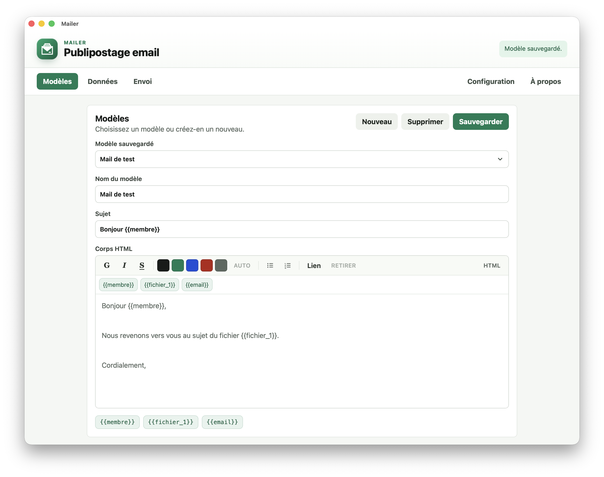

# Mailer

Application bureau pour le publipostage email, avec:

- un éditeur HTML intégré (gras, italique, souligné, listes, liens validés);
- des modèles sauvegardés localement;
- un fichier Excel dont les colonnes alimentent les champs via Handlebars (`{{prenom}}`, etc.);
- une configuration SMTP locale, mot de passe stocké dans le trousseau système;
- un envoi avec progression live, annulation et confirmation;
- des mises à jour signées distribuées via GitHub Releases.




## Développement

Prérequis:

- Node.js 20+;
- Rust stable;
- dépendances système Tauri selon la plateforme cible.

Installation:

```bash
npm install
```

Lancement bureau (dev):

```bash
npm run desktop:dev
```

Build local (non signé, sans updater):

```bash
npm run desktop:build
```

Build release signé (nécessite la pubkey, voir plus bas):

```bash
npm run desktop:release
```

## Utilisation

1. **Modèles** : créer un modèle avec sujet et corps HTML. L'éditeur propose gras / italique / souligné, listes, insertion de lien (http/https/mailto uniquement), et un mode source HTML.
2. **Données** : importer le fichier Excel. La première ligne sert d'en-têtes; les colonnes deviennent des placeholders Handlebars (`{{prenom}}`, `{{societe}}`, ...).
3. **Configuration** : renseigner SMTP (serveur, port, sécurité, identifiant, expéditeur). Le mot de passe est écrit dans le trousseau système (macOS Keychain, Windows Credential Manager, Linux Secret Service) et jamais dans le JSON local. Régler la temporisation: maximum par minute, pause minimale, taille de lot et pause entre lots.
4. **Envoi** : prévisualiser sur des lignes réelles, puis cliquer *Envoyer*. Une confirmation s'affiche avant d'envoyer. Pendant l'exécution, une barre de progression en direct et un bouton *Annuler l'envoi* permettent de reprendre la main.


## Mises à jour GitHub

### Première configuration

1. Générer la paire de clés Tauri:

   ```bash
   npx tauri signer generate -w ~/.tauri/mailer.key
   ```

   Produit `~/.tauri/mailer.key` (privée) et `~/.tauri/mailer.key.pub` (publique).

2. Enregistrer la **clé publique**. Avec le script de release actuel, le plus simple est d'utiliser directement le fichier `.pub`:

   ```bash
   gh secret set TAURI_UPDATER_PUBKEY < ~/.tauri/mailer.key.pub
   ```

   Pour un build local signé, copier aussi le template `.env` et coller le contenu de `~/.tauri/mailer.key.pub` après `TAURI_UPDATER_PUBKEY=`:

   ```bash
   cp src-tauri/.env.example src-tauri/.env
   cat ~/.tauri/mailer.key.pub
   ```

   `src-tauri/.env` est ignoré par git. La clé publique n'est jamais commitée: elle est normalisée puis injectée dans `tauri.release.conf.json` au moment du build par `scripts/inject-release-pubkey.mjs`.

3. Remplacer `OWNER` dans l'endpoint `src-tauri/tauri.release.conf.json` par le propriétaire GitHub réel (déjà fait si le repo est configuré).

4. Ajouter les secrets GitHub Actions (Settings → Secrets and variables → Actions):

   - `TAURI_UPDATER_PUBKEY`: contenu de `~/.tauri/mailer.key.pub` (`gh secret set TAURI_UPDATER_PUBKEY < ~/.tauri/mailer.key.pub`)
   - `TAURI_SIGNING_PRIVATE_KEY`: contenu de `~/.tauri/mailer.key` (`gh secret set TAURI_SIGNING_PRIVATE_KEY < ~/.tauri/mailer.key`)
   - `TAURI_SIGNING_PRIVATE_KEY_PASSWORD`: mot de passe utilisé à la génération, si un mot de passe a été défini

   Si vous préférez stocker les clés en base64, c'est aussi accepté par le script d'injection pour la clé publique. Générer avec:

     ```bash
     # macOS (base64 coupe à 76 colonnes par défaut, on retire les \n)
     base64 -i ~/.tauri/mailer.key | tr -d '\n' | pbcopy
     # Linux
     base64 -w0 ~/.tauri/mailer.key | xclip -selection clipboard
     ```

     Coller la valeur dans le secret.

### Publier une version

```bash
git tag v0.1.0
git push origin v0.1.0
```

Le workflow `.github/workflows/release.yml` injecte la clé publique, construit les installateurs pour macOS / Linux / Windows, signe les artefacts et publie une release brouillon.


## Limites connues

- Pas encore de journal complet des campagnes.
- Pas encore de gestion de pièces jointes.
- Le fichier Excel est relu depuis son chemin d'origine au moment de l'envoi: s'il est déplacé entre import et envoi, l'opération échoue.
